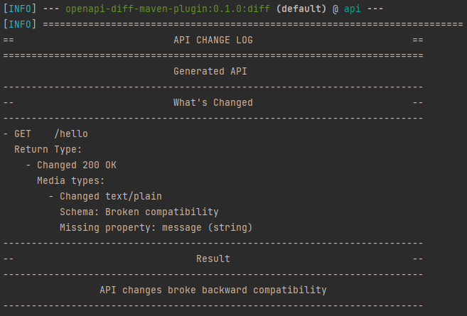

# OpenAPI Diff Maven Plugin

This Maven plugin diffs OpenAPI specifications to tell you what has changed.
It has an optional setting that allows you to raise an error when a change
has broken backward compatibility.



**Example**

```xml
<plugin>
  <groupId>ca.wheatstalk</groupId>
  <artifactId>openapi-diff-maven-plugin</artifactId>
  <version>0.1.0</version>
  <executions>
    <execution>
      <goals>
        <goal>diff</goal>
      </goals>
      <configuration>
        <!-- Reference specification (perhaps your prod schema) -->
        <oldSpec>https://petstore3.swagger.io/api/v3/openapi.json</oldSpec>
        <!-- Specification generated by your project in the compile phase -->
        <newSpec>${project.basedir}/target/openapi.yaml</newSpec>
        <failWhenIncompatible>true</failWhenIncompatible>
      </configuration>
    </execution>
  </executions>
</plugin>
```